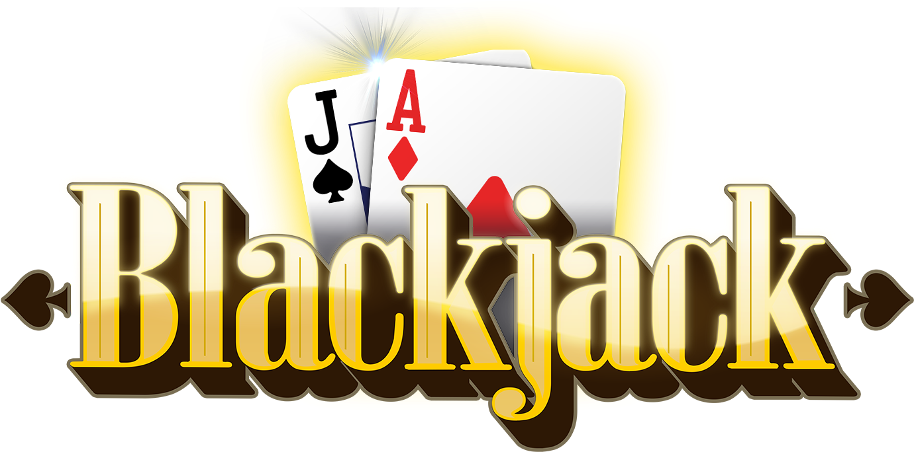
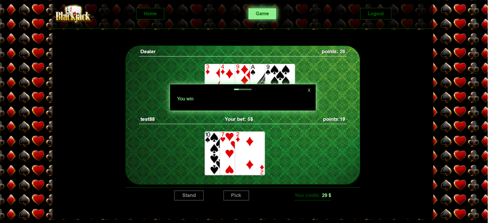

<div align="center">

  
  
<h1>
    <a href="https://black-jack.networkmanager.pl/">View Demo</a>
  </h1>
</div>

<br />

# :notebook_with_decorative_cover: Table of Contents

- [About the Project](#star2-about-the-project)
  - [Screenshots](#camera-screenshots)
  - [Tech Stack](#space_invader-tech-stack)
  - [Color Reference](#art-color-reference)
- [Getting Started](#toolbox-getting-started)
  - [Run Locally](#running-run-locally)
- [Contact](#handshake-contact)
- [Acknowledgements](#gem-acknowledgements)

## :star2: About the Project

Project is a replication of the popular black jack card game. It was created to show my skills.
It was written using React version 18 in conjunction with typescripterm.I use the styled-components library and create a view for the desktop and mobile. I use the react-hook library for form handling and validation. I use my own hooks to data fetch and the user authenticate. I use useContext for the global state.
I also use react Router for navigating.
This project is closely connected with the backend which has been placed in a separate repository. Backend here:<a href="https://github.com/Michalus88/BlackJack-Nest-mongo.git">BlackJack-Nest-mongo</a>

### :camera: Screenshots

#### Register deskopt

<div align="center"> 
  
</div>

#### Register mobile


<div align="center"> 
  
</div>


#### Error deskopt

<div>
  
</div>


#### Game deskopt

<div align="center"> 
  
</div>


#### Game mobile

<div align="center"> 
  
</div>

#### Game mobile landscape

<div align="center"> 
  
</div>

### :space_invader: Tech Stack

  <ul>
    <li><a href="https://www.typescriptlang.org/">Typescript</a></li>
    <li><a href="https://reactjs.org/">React.js</a></li>
  </ul>

### :art: Color Reference

| Color           | Hex      |
| --------------- | -------- |
| Primary Color   | 006400FF |
| Secondary Color | 000000FF |
| Accent Color    | 90EE90FF |

## :toolbox: Getting Started

### :running: Run Locally

#### BEFORE STARTED YOU SHOULD KNOW

If you want to enjoy a fully functioning project, you should put both BlackJack-React-ts
and BlackJack-Nest-mongo projects both in one folder, each in your own folder.
Folder names should remain unchanged. Before you start running BlackJack-React-ts,
first download and run the backend -<a href="https://github.com/Michalus88/BlackJack-Nest-mongo.git">BlackJack-Nest-mongo</a>

Clone the project

```bash
  git clone https://github.com/Michalus88/BlackJack-React-ts.git
```

Go to the project directory

```bash
  cd BlackJack-React-ts
```

Install dependencies

```bash
  npm install
```

Start the server

```bash
  npm start
```

## :handshake: Contact

Michał Molenda: [Gmail](mailto:michalus88@gmail.com)

## :gem: Acknowledgements

- [styled-components](https://styled-components.com/)
- [react-hook-form](https://react-hook-form.com/)
